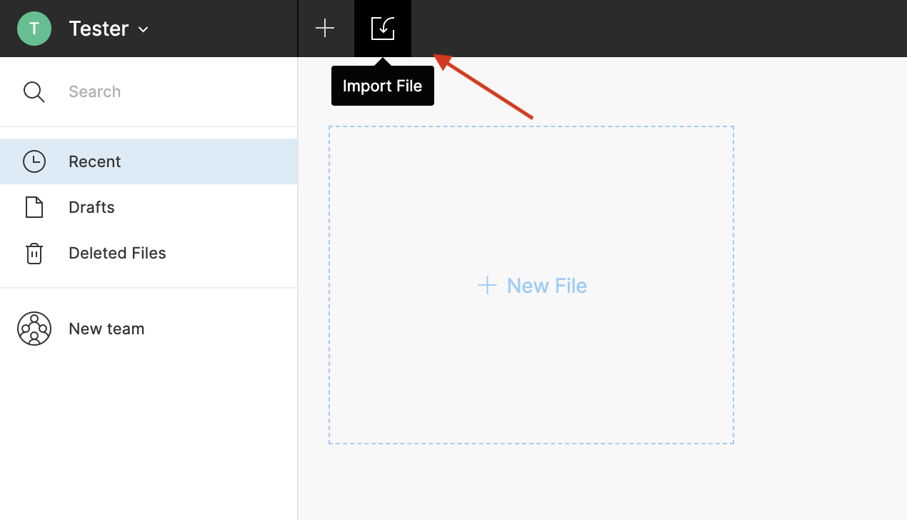

# Contributing to Android Developer Roadmap 2020

**Para a versão em portuguese, [clique aqui](./contributing_pt_br.md)**
**Para la versión en español, [clic aquí](./contributing_es.md)**

## Generating discussions

If you have any suggestion about something that should be in the roadmap and if you want to validate it, we strongly recommend that you create an `issue` on our repository. In this way, we can achieve rich discussions that certanly will help a lot of people about the adoption of the content in its developments.

## Creating improvements

If you have any improvements that you want to do directly in the roadmap, we recomend that you create a `pull request` with basicaly two files: the **roadmap image** and the **.fig file**, both updated. Try to be descriptive in your PR, so we can analyze and discuss about what you are proposing. 

### Using Figma

Our project is built with [Figma](https://www.figma.com/). It is a free tool used to build prototypes, which turns out to be a better choice for the roadmap, because the idea here is that everyone can use the tool and improve the content.

1. Importing the roadmap

    After you clone the repository, you will find inside the `project` folder the file `Android Developer Roadmap 2020.fig`. With this file, you can import the project in your Figma profile to edit it.

    

2. Accessing and editing the content

    After uploading the file, you can access the content by double-clicking the `Android Developer Roadmap 2020`. With right click, you must ungroup the content to have access to each component to edit it.

    

    Now you can click on each component, inner component end everythinh else to change what you want. Notice that we have a major box component (the box with the content `Programming Language`) and changing it the changes will be applied to each other component.

3. Exporting the changes

    After you update the content, you must `export the .fig file`. You can do it by clicking in the `menu on the left > file > Save as .fig...`.

    

    As part of the pull request, you need to send also the image updated. To do this, you must `group the content` with the same steps that you did to ungroup it. After this, you can notice that an option `export` will be showed down in the right menu. Click in the `+`, fill the Sufix, keep the `PNG` format and click in `Export Group x`. The image will be downloaded.

    

    The pattern that we use for the .fig file is `Android Developer Roadmap 2020.fig` and for the image is `android_roadmap.png`. You must use the same.

## Give us feedbacks!

Is this file helpful? Did you have any difficulties to do your updates or suggestions? Please let us know! With you help we can not only improve the roadmap but this step by step about how to improve it with us.